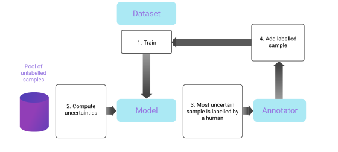

<p align="center">
  
  <h1 align="center">Bayesian Active Learning (Baal)
   <br>
  <a href="https://github.com/baal-org/baal/actions/workflows/pythonci.yml">
    
  </a>
  <a href="https://baal.readthedocs.io/en/latest/?badge=latest">
    
  </a>
  <a href="https://join.slack.com/t/baal-world/shared_invite/zt-z0izhn4y-Jt6Zu5dZaV2rsAS9sdISfg">
    
  </a>
  <a href="https://github.com/Elementai/baal/blob/master/LICENSE">
    
  </a>
  <a href="https://calendly.com/baal-org/30min">
    
  </a>
  <a href="https://pepy.tech/project/baal">
    
  </a>

  </h1>
</p>

Baal is an active learning library that supports both industrial applications and research usecases.

Read the documentation at https://baal.readthedocs.io.

Our paper can be read on [arXiv](https://arxiv.org/abs/2006.09916). It includes tips and tricks to make active learning
usable in production.

For a quick introduction to Baal and Bayesian active learning, please see these links:

- [Seminar with Label Studio](https://www.youtube.com/watch?v=HG7imRQN3-k)
- [User guide](https://baal.readthedocs.io/en/latest/user_guide/index.html)
- [Bayesian active learning presentation](https://drive.google.com/file/d/13UUDsS1rvqDnXza7L0j4bnqyhOT5TDSt/view?usp=sharing)

*Baal was initially developed at [ElementAI](https://www.elementai.com/) (acquired by ServiceNow in 2021), but is now independant.*


## Installation and requirements

Baal requires `Python>=3.8`.

To install Baal using pip: `pip install baal`

We use [Poetry](https://python-poetry.org/) as our package manager.
To install Baal from source: `poetry install`

## Papers using Baal

- [Bayesian active learning for production, a systematic study and a reusable library
  ](https://arxiv.org/abs/2006.09916) (Atighehchian et al. 2020)
- [Synbols: Probing Learning Algorithms with Synthetic Datasets
  ](https://nips.cc/virtual/2020/public/poster_0169cf885f882efd795951253db5cdfb.html) (Lacoste et al. 2020)
- [Can Active Learning Preemptively Mitigate Fairness Issues?
  ](https://arxiv.org/pdf/2104.06879.pdf) (Branchaud-Charron et al. 2021)
- [Active learning with MaskAL reduces annotation effort for training Mask R-CNN](https://arxiv.org/abs/2112.06586) (
  Blok et al. 2021)
- [Stochastic Batch Acquisition for Deep Active Learning](https://arxiv.org/abs/2106.12059) (Kirsch et al. 2022)

# What is active learning?

Active learning is a special case of machine learning in which a learning algorithm is able to interactively query the
user (or some other information source) to obtain the desired outputs at new data points
(to understand the concept in more depth, refer to our [tutorial](https://baal.readthedocs.io/en/latest/)).

## Baal Framework

At the moment Baal supports the following methods to perform active learning.

- Monte-Carlo Dropout (Gal et al. 2015)
- MCDropConnect (Mobiny et al. 2019)
- Deep ensembles
- Semi-supervised learning

If you want to propose new methods, please submit an issue.

The **Monte-Carlo Dropout** method is a known approximation for Bayesian neural networks. In this method, the Dropout
layer is used both in training and test time. By running the model multiple times whilst randomly dropping weights, we
calculate the uncertainty of the prediction using one of the uncertainty measurements
in [heuristics.py](baal/active/heuristics/heuristics.py).

The framework consists of four main parts, as demonstrated in the flowchart below:

- ActiveLearningDataset
- Heuristics
- ModelWrapper
- ActiveLearningLoop

<p align="center">
  
</p>

To get started, wrap your dataset in our _[**ActiveLearningDataset**](baal/active/dataset.py)_ class. This will ensure
that the dataset is split into
`training` and `pool` sets. The `pool` set represents the portion of the training set which is yet to be labelled.

We provide a lightweight object _[**ModelWrapper**](baal/modelwrapper.py)_ similar to `keras.Model` to make it easier to
train and test the model. If your model is not ready for active learning, we provide Modules to prepare them.

For example, the _[**MCDropoutModule**](baal/bayesian/dropout.py)_ wrapper changes the existing dropout layer to be used
in both training and inference time and the `ModelWrapper` makes the specifies the number of iterations to run at
training and inference.

Finally, _[**ActiveLearningLoop**](baal/active/active_loop.py)_ automatically computes the uncertainty and label the most
uncertain items in the pool.

In conclusion, your script should be similar to this:

```python
dataset = ActiveLearningDataset(your_dataset)
dataset.label_randomly(INITIAL_POOL)  # label some data
model = MCDropoutModule(your_model)
model = ModelWrapper(model, your_criterion)
active_loop = ActiveLearningLoop(dataset,
                                 get_probabilities=model.predict_on_dataset,
                                 heuristic=heuristics.BALD(),
                                 iterations=20, # Number of MC sampling.
                                 query_size=QUERY_SIZE)  # Number of item to label.
for al_step in range(N_ALSTEP):
    model.train_on_dataset(dataset, optimizer, BATCH_SIZE, use_cuda=use_cuda)
    metrics = model.test_on_dataset(test_dataset, BATCH_SIZE)
    # Label the next most uncertain items.
    if not active_loop.step():
        # We're done!
        break
```

For a complete experiment, see _[experiments/vgg_mcdropout_cifar10.py](experiments/vgg_mcdropout_cifar10.py)_ .

### Re-run our Experiments

```bash
docker build [--target base_baal] -t baal .
docker run --rm baal --gpus all python3 experiments/vgg_mcdropout_cifar10.py
```

### Use Baal for YOUR Experiments

Simply clone the repo, and create your own experiment script similar to the example
at _[experiments/vgg_mcdropout_cifar10.py](experiments/vgg_mcdropout_cifar10.py)_. Make sure to use the four main parts of Baal
framework. _Happy running experiments_

### Contributing!

To contribute, see [CONTRIBUTING.md](./CONTRIBUTING.md).

### Who We Are!

"There is passion, yet peace; serenity, yet emotion; chaos, yet order."

The Baal team tests and implements the most recent papers on uncertainty estimation and active learning.

Current maintainers:

- [Parmida Atighehchian](mailto:patighehchian@twitter.com)
- [Frédéric Branchaud-Charron](mailto:frederic.branchaud-charron@gmail.com)
- [George Pearse](georgehwp26@gmail.com)

### How to cite

If you used Baal in one of your project, we would greatly appreciate if you cite this library using this Bibtex:

```
@misc{atighehchian2019baal,
  title={Baal, a bayesian active learning library},
  author={Atighehchian, Parmida and Branchaud-Charron, Frederic and Freyberg, Jan and Pardinas, Rafael and Schell, Lorne
          and Pearse, George},
  year={2022},
  howpublished={\url{https://github.com/baal-org/baal/}},
}
```

### Licence

To get information on licence of this API please read [LICENCE](./LICENSE)
