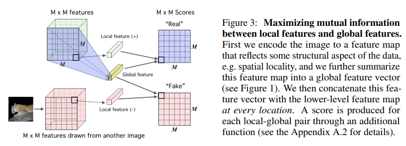

## Deep InfoMax

[URL](https://arxiv.org/pdf/1808.06670.pdf)

The authors propose a new method for unsupervised representation learning by using adversarial networks.

As shown in Fig. 3, the features extracted from the local features (top of the network) and global features (the embedding).

A key component of their method is that they use three discriminators. 
* Global discriminator
  * Compare the global encoding to the local feature.
* Local discriminator
  * Compare the local features.
* Prior discriminator
  * Force the embedding to a known prior.
  
 
They achieve impressive results on classification and on other tasks. For example, by using a SVM on the embeddings, they get an accuracy of
 75.21% on CIFAR10 and 49.74% on CIFAR100. For comparison, training the same generator in a fully-supervised setting would get 75.39% on CIFAR10 and 42.27% on CIFAR100.
 
 
