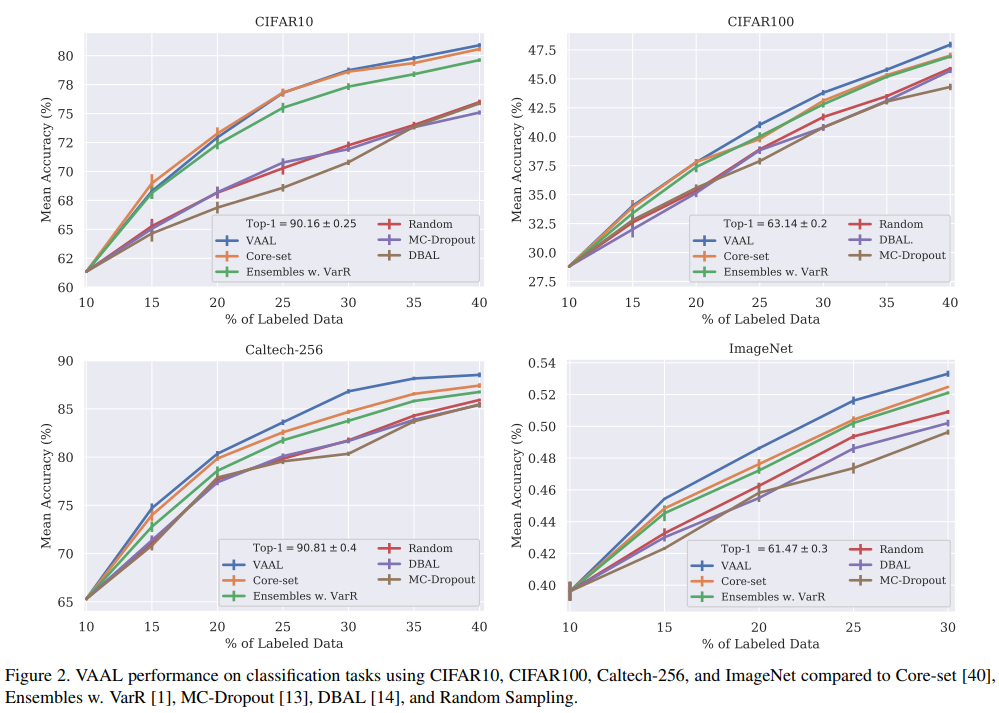

# Variational adversarial Active Learning (VAAL)

This [paper](https://arxiv.org/abs/1904.00370) proposes a new Active Learning algorithm that is not task-dependent. 
To do so, they use a GAN architecture where the generator is a *beta*-VAE and the discriminator is a simple MLP. This MLP takes the embedding and predicts whether or not the input is a labeled sample.

The loss is then the sum of the VAE Loss and the adversarial loss. 

The next sample to label is chosen by the discriminator. From all the samples from the pool, the sample with the highest certainty is chosen. 

## Results

They present impressive results on classification and segmentation. We should note that in their results, MC-Dropout is the worst method. This is not what we've been seeing in practice. 

## Efficiency

Their method is much faster than other methods such as MC-Dropout. During inference, you only need to run the encoder and the discriminator once. On CIFAR10, they are 8x faster than MC-Dropout.