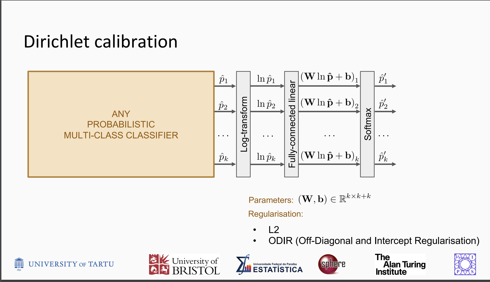
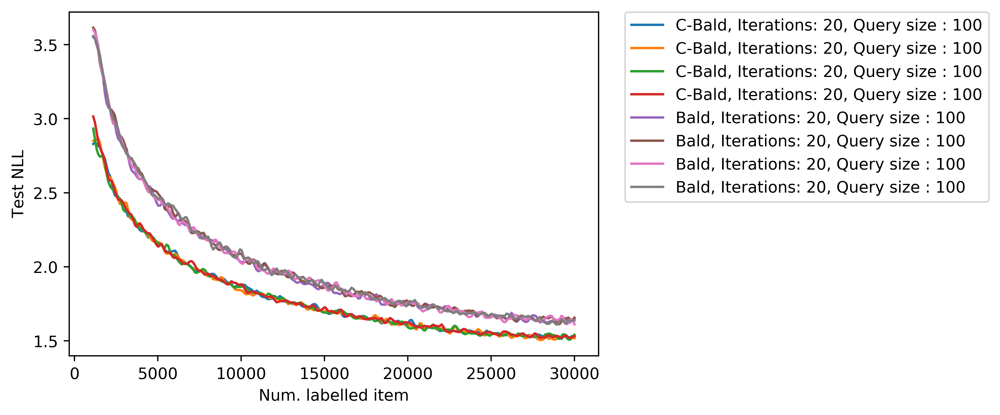
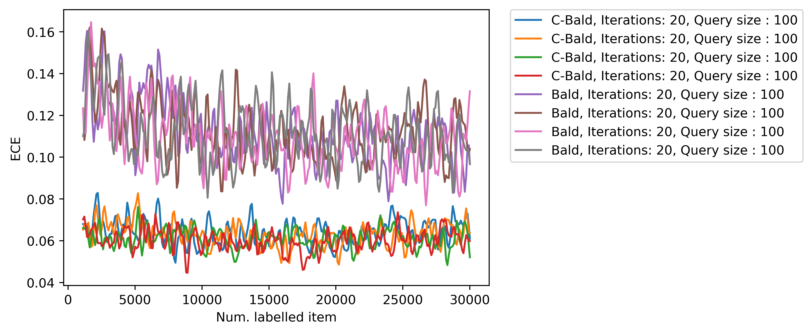
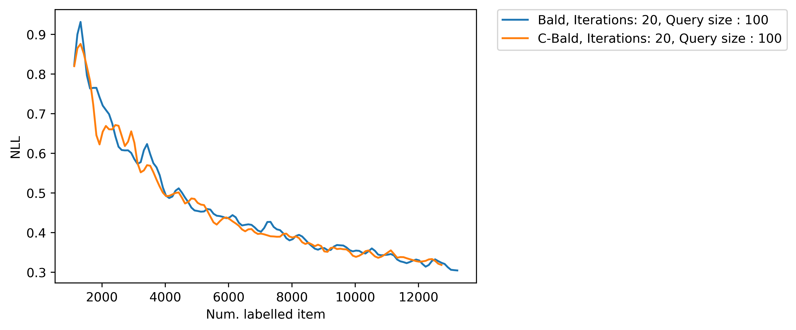
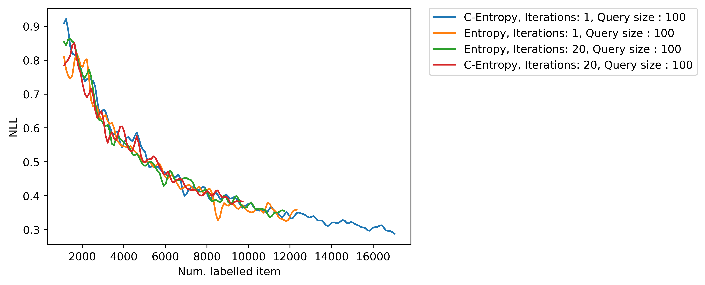
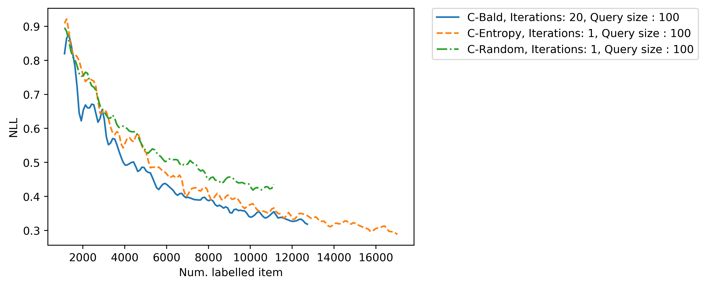

# Report on using Dirichlet calibration for active learning

A [paper recently published at NeurIPS 2019](https://dirichletcal.github.io/) proposes to estimate a dirichlet distribution to model the uncertainty of a prediction.

To achieve that, they add a new linear layer at the end of the network and train it individually on a held-out set. 

Here is a figure from the authors' NeurIPS 2019 presentation. You can find the full presentation on the website above.

<figure markdown>
{ width="500" }
  <figcaption>Dirichlet Calibration NeurIPS 2019</figcaption>
</figure>

Our hypothesis is as follows: by modelling the uncertainty on an held-out set, we want to create a better estimation of the overall uncertainty.

A common flaw on uncertainty estimation technique using Variational Inference (VI) such as MC-Dropout is that they only model the epistemic uncertainty ie. the uncertainty of the model.


Current SotA methods for active learning rely on VI to estimate the model uncertainty. Due to the lack of data, those methods are often not better than random due to overfitting or underfitting. By introducing calibration, we hope to reduce the need for VI and to rely on calibrated predictions to select the next sample to label.


## Methodology

Our methodology follows a standard active learning pipeline, but we add a new training set $D_{L}$ which is used to train the calibration layer. After training the model on the training set $D_{train}$ to convergence, we train it on this held-out set and train the newly added layer.

We call the augmented model $M_{calib}$. We perform the sample selection using one of the following techniques:

* Entropy: $\sum_c p_i \log(p_i)$
* BALD using MC-Dropout: $H[y \mid x, D_{L}] - E_{p(w \mid D_L)}(H[y \mid x, w])$
* Uniform random selection

Because we want to analyze the actual gain of using calibration, we compare the effect of using $M$ versus $M_{calib}$ across all techniques.

## Experiments

We test our hypothesis on CIFAR10 using a VGG-16. We initially label 1000 samples and label 100 samples per step. When using MC-Dropout, we set the number of Monte-Carlo sampling to 20.

### Testing calibration

We first want to ensure that calibration works properly. In Fig. 2, we show that throughout the active learning procedure, the calibrated loss is better than the non-calibrated loss.

<figure markdown>
{ width="500" align="center"}
  <figcaption>Comparison between the calibrated loss and the uncalibrated loss.</figcaption>
</figure>


Furthermore, we compute the ECE between both cases.


<figure markdown>
{ width="500" align="center"}
  <figcaption>Comparison between ECE for both Calibrated BALD and BALD.</figcaption>
</figure>

### Impact of calibration on active learning

For each method, we present the calibrated NLL at each active learning step.
We want to compare the selection process between $M$ and $M_{calib}$.
Our reasoning is as follow. We want to see if the calibrated model would pick better items over the normal one.
To do so we make two experiments, one where we use $M$ to select the new samples and the other uses $M_{calib}$.
In both cases, we will get a calibrated model to compare the calibrated loss.

<figure markdown>
{ width="500"}
  <figcaption>Comparison between a calibrated selector and an uncalibrated one using BALD.</figcaption>
</figure>

<figure markdown>
{ width="500"}
  <figcaption>Comparison between a calibrated selector and an uncalibrated one using Entropy.</figcaption>
</figure>

<figure markdown>
{ width="500" }
  <figcaption>Comparison between calibrated selectors.</figcaption>
</figure>


In addition, we show that BALD is still better in all cases.


## Discussion

While we have not seen improvements by using calibration on an active learning benchmark, we still find this report useful. Active learning is but a part of the Human-ai-interaction (HAII) process. By adding an easy to use calibration method, we can further the collaboration between the human and our model. 

By giving more nuanced predictions, the model is deemed more trustable by the human annotator. 


### Calibration in Baal

With Baal 1.2, we add a new module based on this report. We propose new tools and methods to calibrate your model. Our first method will be a Pytorch implementation of the Dirichlet Calibration method. Here is an example:

```python
from baal.calibration import DirichletCalibrator
from baal.modelwrapper import ModelWrapper, TrainingArgs

"""
Get your train and validation set. In addition, you need a
held-out set to calibrate your model.
"""
train_ds, calib_ds, valid_ds = get_datasets()
wrapper = ModelWrapper(MyModel(), TrainingArgs(...))

# Make a calibrator object.
calibrator = DirichletCalibrator(wrapper, 2, lr=0.001, reg_factor=0.001)

# Train your model as usual.
wrapper.train_on_dataset(train_ds)

# Calibrate your model on a held-out set.
calibrator.calibrate(calib_ds, valid_ds, use_cuda=True, double_fit=True)
calibrated_model = calibrator.calibrated_model
```


## Conclusion

In this report, we tested the effect of calibration on an active learning pipeline. In addition, our code is freely available in our open source library.

## Author(s)
- Frédéric Branchaud-Charron
- Parmida Atighehchian