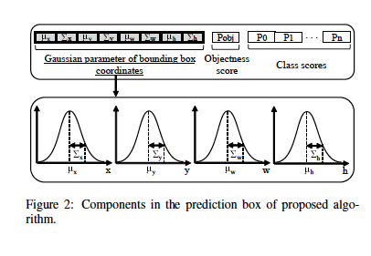
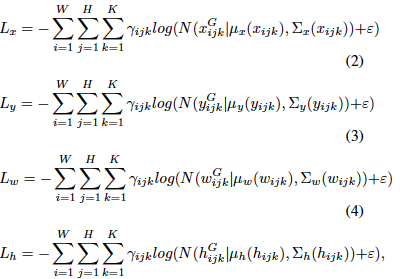
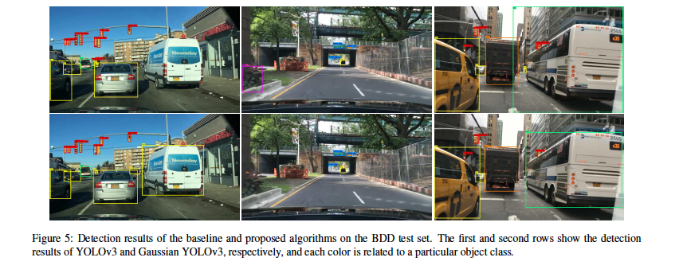

# Gaussian YOLOV3
This [paper](https://arxiv.org/pdf/1904.04620.pdf) proposes on how to change the deterministic bounding box output of object detection models to uncertainty score.
The only proposed change in the model is to replace the detection layer with a single Gaussian model. Hence, the model will output the mean and variance of each coordinated (a vector of size 8 instead of 4).

The loss function of the bounding box detection section would be changed to negative log likelihood as below:

## Results
The main concern of using Gaussian approaches is their memory consumption, however as they only propose using a single Gaussian model for the detection layer,
the memory consumption is almost not affected whereas mAP is increased by 3% on the two datasets of their choice (KITTI, BDD) comparing to YOLOV3. Based on
the provided results, their proposed model increases the TP on the both datasets at least by 4% and reduces the FP by at least 40%.

