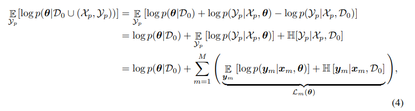
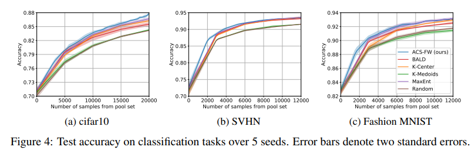

# Bayesian Batch Active Learning as Sparse Subset Approximation

Robert Pinsler, Jonathan Gordon, Eric Nalisnick and José Miguel Hernández-Lobato

Published at NeurIPS 2019

[ArXiv](https://arxiv.org/pdf/1908.02144.pdf)

[Code](https://github.com/rpinsler/active-bayesian-coresets)

A known issue of BALD, when used in Batch Active Learning is that it selects highly correlated samples.
By combining BNNs with a novel coreset algorithm, the authors propose a way to estimate the true posterior data distribution.

In brief, they want to select a batch $D'$ such that the posterior distribution best approximate the complete data posterior.
 Because we do not know the complete posterior, the authors approximate it using the predictive distribution. The idea is summarized in Eq. 4.

This measure can be optimized using Frank-Wolfe which uses the dot-product $\langle L_m, L_n\rangle$ to estimate the affectations.

While a closed-form procedure exists to compute this dot-product, it is expensive to run ($O(||P||^2)$).
The authors suggest the use of random projections drawn from the parameters distribution $\hat\pi$.
This approximation makes the algorithm $O(||P||J)$, where J is the number of samples drawn from $\hat\pi$. 

In Fig 4, the authors show results on multiple datasets showing that their method is better than BALD or Entropy. 

### My two cents

This method is interesting as it is less computationally expensive than BatchBALD with the same goal in mind ie. solving the correlated selection in BALD.

In their work, they use a batch size of 3000. From our experiments, we know that BALD does work with a lower, but still large query size (250 for example).
While this shows that their method works with high batch size, I would have liked to see a comparison between their method and BALD on a smaller query size.
In Annex D, they show that MC-Dropout is also affected by the large query size.

